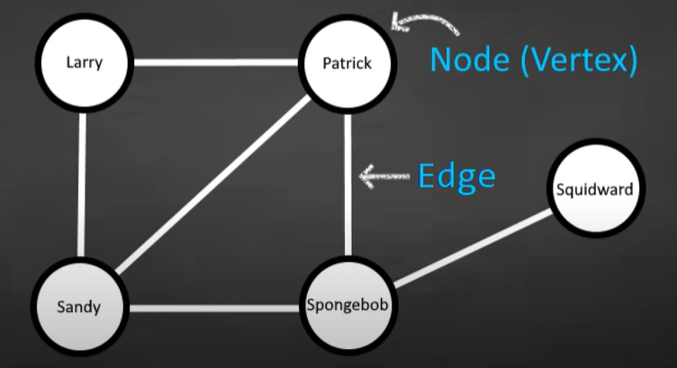

Graph

Collection of nodes (or vertices) and edges that connect pairs of nodes.



Types of Graphs
* Directed Graph (Digraph): Edges have a direction.
* Undirected Graph: Edges do not have a direction.
* Weighted Graph: Edges have weights representing costs, distances, or any other metric.
* Unweighted Graph: Edges do not have weights

Adjacency List
An adjacency list represents a graph as a collection of lists. Each list corresponds to a node and contains a list of its adjacent nodes.

Undirected Graph:

```
A - B
|   |
C - D
```

